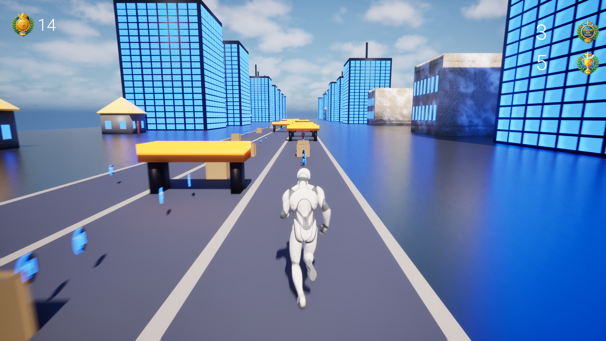
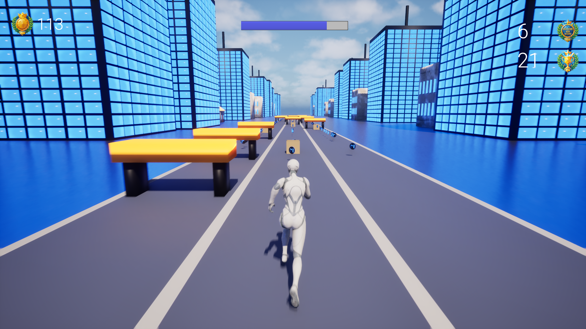
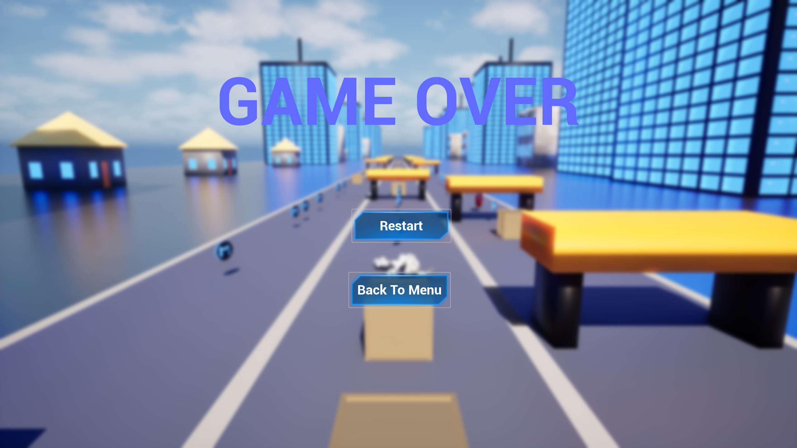

# Merito Runner

**Status:** Zarchiwizowany | Projekt ukończony  

---

## Cel projektu

Głównym celem projektu było stworzenie naszej pierwszej gry w silniku Unreal Engine w ramach zaliczenia przedmiotu na uczelni Merito. Skupiliśmy się na praktycznym poznaniu środowiska, w tym obsługi viewportów, logiki Blueprintów oraz zarządzania interfejsem użytkownika. Projekt pozwolił nam w praktyce przetestować systemy kolizji, dodawanie obiektów oraz realizację płynnych przejść między scenami, stanowiąc fundament naszej edukacji w tym silniku.

---

## O co chodzi w grze

Merito Runner to zręcznościowa gra typu endless runner, w której gracz stara się pobić rekord odległości, omijając pułapki poprzez skoki lub ślizgi. Podczas biegu zbieramy również monety, w czym pomaga m.in. specjalny power-up w postaci magnesu przyciągającego kosztowności. Gra oferuje również system wyboru postaci oraz oprawę wizualną z budynkami w tle.

---

## Zrzuty ekranu

  
  
